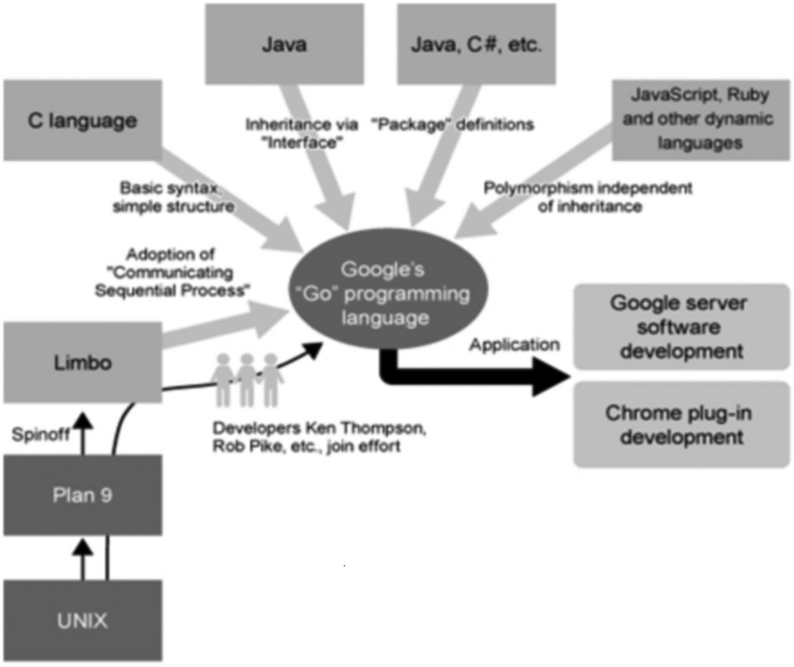

# class1:总论、GO语言的由来与特性

## PART1. 课程导论

模块1:GO语言

模块2:容器技术

模块3:K8S技术栈

## PART2. GO语言特性

### 2.1 统一思想-12 factors

起源:Martin Fowler

1. 基准代码
	
	一份基准代码,多份部署.强调代码驱动部署.这意味着任何部署到生产系统的代码,都应该在代码仓库中存在一份基准代码.这样当生产系统出现故障时,可以找到对应版本的源代码,做根因分析.

2. 依赖

	显式声明依赖关系.一些传统语言(如C语言),需要有头文件做声明.但C语言的依赖关系无法声明依赖的文件与具体版本.这样发展下去,项目后期依赖管理会很难做.

3. 配置
	
	在环境中存储配置.鼓励把代码和配置分离的做法.以GO语言为例,编译后是一个可执行文件.好处在于当生产系统变更时,需要走整个流水线,需要把源代码进行构建测试,再根据流水线的定义,把代码发布到不同的环境.**代码变更的流程较重**.
	
	但如果只是修改配置,这个行为有时候是可以在生产系统直接进行的.
	
4. 后端服务

	把后端服务当做附加资源.

5. 构建,发布,运行

	严格分离构建和运行

6. 进程

	以一个或多个无状态进程运行应用.这样做的好处在于:进程不依赖于数据.当进程出现问题时,可随意停止并用另一个进程替换该进程.

7. 端口绑定

	通过端口绑定提供服务

8. 并发

	通过进程模型进行扩展

9. 易处理

	快速启动和优雅终止可最大化健壮性

10. 开发环境与线上环境等价

	尽可能的保持开发,预发布,线上环境相同

11. 日志

	把日志当做事件流

12. 管理进程

	后台管理任务当做一次性进程运行

### 2.2 为什么需要GO语言?

Less is exponentially(adj. 以指数方式) more

Do Less, Enable More

GO语言尽可能把语言和实现精简,对RD(Research & Developer)人员友好.其优点在于:语言简单易上手,则开发效率就快.即提升生产效率.

**理解任何一门新技术之前,都要先理解这门技术解决的痛点:**

- 其他编程语言的弊端
	
	- 硬件发展速度远超软件 (硬件遵循摩尔定律,但语言发展速度较慢)
	- C语言等原生语言缺乏好的依赖管理
	- JAVA和C++等语言过于笨重
	- 传统语言对GC和并行计算等基础功能缺乏支持
	- 对多核计算机缺乏支持 (代码不能很好地利用计算机的资源)

- GO语言是一个可以编译高效的,支持高并发的,面向垃圾回收的全新语言

	- 秒级完成大型程序的单节点编译
	- 依赖管理清晰
	- 不支持继承,RD无需花费精力定义不同类型之间的关系
	- 支持GC,支持并发执行,支持多线程通讯
	- 对多核计算机支持友好

- GO语言不支持的特性

	- 不支持函数重载和操作符重载
	- 为避免在C/C++开发中出现的一些Bug和混乱,不支持隐式转换
	- 支持接口抽象,不支持继承(组合优于继承)
	- 不支持动态加载代码
	- 不支持DLL(优点:编译后不需任何其他依赖即可直接运行;缺点:编译后的文件大小会略微大一些.但存储相比于时间是廉价资源)
	- 通过`recover`和`panic`来替代异常机制
	- 不支持断言
	- 不支持静态变量

[GO语言特性衍生来源](https://github.com/unknwon/the-way-to-go_ZH_CN/blob/master/eBook/01.2.md):

