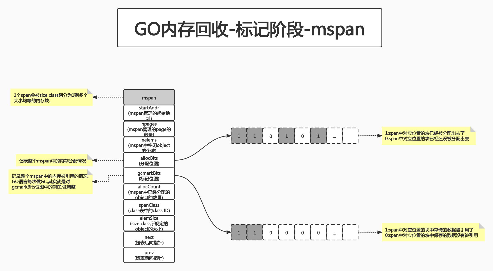
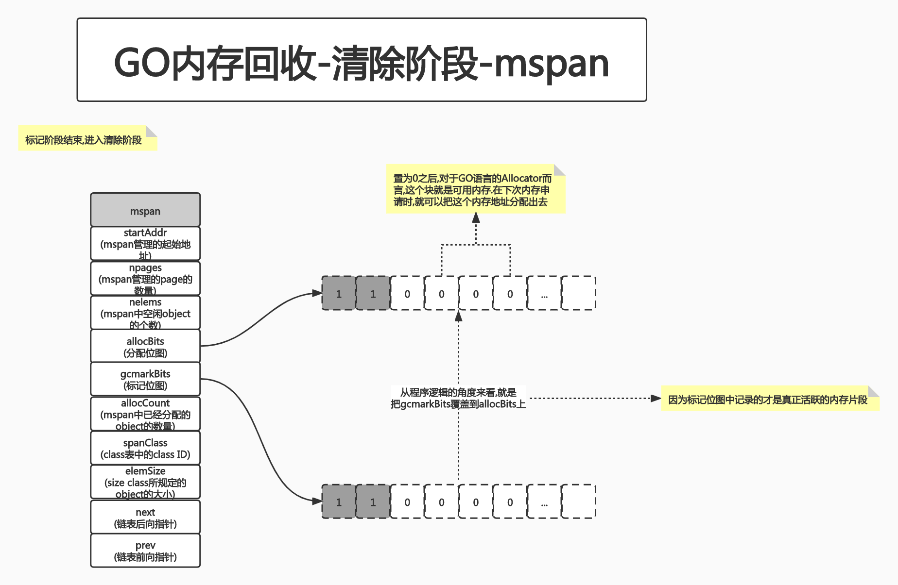
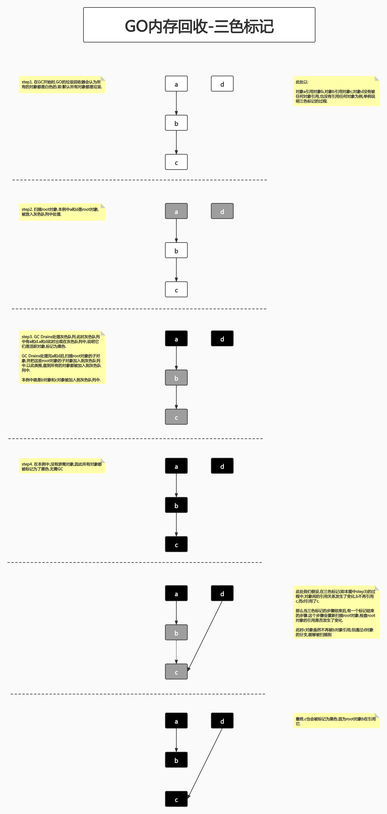

# class3:GO语言内存管理

1. 关于内存管理的争论
2. 堆内存管理的挑战
3. 堆内存管理
4. TCMallc概览
5. TCMallc
6. GO语言内存分配
7. 内存回收
8. mspan
9. GC工作流程
10. 三色标记
11. GC触发机制

## 引言 关于内存管理的争论

论点1:手动管理内存麻烦且容易出错,应该交给机器(这里的机器我认为可以理解为某种对研发人员透明的机制)去管理(JAVA/Golang).

论点2:交给机器管理容易出现一些奇怪(可以认为在某些场景下无法解释)的问题,因此需要手动管理(C/C++).

差异:C/C++这种内存管理方式,对研发人员的要求较高.而现代化语言,往往更追求研发效率,减少人为错误出现的概率.

## PART1. 堆内存管理

栈内存往往比较安全.因为栈内存是和线程绑定的,一个线程退出了,那么这个线程的栈内存就释放了.所以当我们在谈内存管理时,更多的谈的是堆内存.

### 1.1 堆内存管理的挑战

1. 内存分配需要syscall,在频繁内存分配的场景下,系统性能较低

	C/C++,声明变量时需要通过syscall(比如malloc)来申请内存,但malloc本身有开销,如果频繁申请内存,则系统性能较低

2. 多线程共享相同的内存空间,同时申请内存时,需要加锁,否则会产生同一块内存被多个线程访问的情况(竞争条件).

	多线程同时(可以理解为在同一时刻)申请内存,很有可能申请到同一块内存.为了解决这个问题,就需要一种保护机制,用于保护同一块内存在一个时刻只能被1个线程使用.加锁就是这种保护机制,但加锁意味着程序的效率变低
	
3. 内存碎片问题,经过不断的内存分配和回收,内存碎片会比较严重,内存的使用效率降低

	内存碎片:简单理解就是以小且不连续的方式出现在不同的位置的空闲内存.至于具体有多小,那要看内存管理的算法.
	
	随着不断地申请、释放内存,最终内存中会出现很多碎片,那么内存的总体资源利用率就不高了.那么很可能出现的一种情况是:随着程序运行时间的不断增长,内存碎片过多导致无法给大对象分配内存了.
	
注:其实动态分配内存还容易出现一个问题--内存泄漏

内存泄漏(memory leak):又称"存储渗漏",指程序中已动态分配的堆内存,由于某种原因(可能是忘了手动释放,也可能是释放失败)导致的在使用完毕后未能释放.其结果导致该内存单元一直被占据,直到程序结束.

对于GO语言的程序来讲,编译完成后是一个二进制文件,通常这个二进制文件跑起来之后,从外部视角来看是一个比较稳定的服务,那么大概率它跑起来之后就不会停,因此也没有机会走到"程序结束"的那一刻,那么其结果就是:该进程所占用的内存不断增大.

内存泄漏属于遗漏型缺陷而非过错型缺陷,很难第一时间被发现.

### 1.2 堆内存管理

Allocator:内存分配器,处理动态内存分配请求.主要做内存的预分配.通常Allocator会在系统初始化(比如用户进程启动)的时,先向OS申请一大片内存作为程序的堆内存,然后对这一大片内存做一定的格式化.

TODO:Allocator是OS层面的东西还是用户进程层面的东西?

Mutator:用户程序,通过Allocator创建对象.用户进程需要向OS申请内存,在这种模式(架构)下,Mutator是向Allocator申请内存的.Allocator会把预分配的内存,按照Mutator的需求切出一小块分给用户程序.

Object Header:对象头,是给Collector和Allocator同步信息用的一种元数据.Allocator分配出去一块内存时,同时要对这块内存做标记(比如这块内存是否使用/分配出去这一块内存的大小等信息),这些标记性的数据(元数据),就被写在Object Header中.

Collector:垃圾回收器,回收内存空间.Mutator只需申请,不需释放.释放的工作由Collector来完成.Collector会扫描整个堆内存,扫描所有的Object Header即可得知:哪些对象(此处的对象可以理解为是被分配出去的那一小块内存)是被分配的;哪些对象是未使用的;哪些对象是活跃对象;哪些对象是非活跃对象等信息.当扫描到非活跃对象时,那么这块内存就可以被自动回收了.

### 1.3 GO语言的堆内存管理

1. 初始化连续内存块作为堆

	 Allocator会申请连续的内存块作为堆.
	 
2. 有内存申请时,Allocator从堆内存中的未分配区域中,分割小内存块并分配出去.并且用链表将已分配的内存连接起来
3. 需要信息描述每个内存块的元数据:大小,是否使用,下一个内存块地址等

	内存的分配和回收其实就是对Object Header的一个修改和管理
	

## PART2. GO语言内存分配

### 2.1 TCMalloc概览

[TCMalloc概览](https://github.com/rayallen20/cloudNativeExercise/blob/master/note/module2-Write%20the%20GO%20program/class3-GO%E8%AF%AD%E8%A8%80%E5%86%85%E5%AD%98%E7%AE%A1%E7%90%86/extend/TCMalloc%E5%86%85%E5%AD%98%E5%88%86%E9%85%8D%E7%AE%97%E6%B3%95.md)

- page:内存页.一块8K大小的内存空间.Go与操作系统之间的内存申请和释放,都是以page为单位的
- span:内存块.一个或多个连续的page组成一个span
- sizeclass:空间规格.每个span都带有一个sizeclass,标记着该span中的page应该如何使用
- object:对象.用来存储一个变量数据内存空间,一个span在初始化时,会被切割成一堆等大的object;假设object的大小是 16B,span大小是8K,那么span中的page就会被初始化成 8K / 16B = 512 个 object,所谓内存分配,就是分配一个 object 出去
- 对象大小定义
	- 小对象:(0, 256KB]
	- 中对象:(256KB, 1MB]
	- 大对象:(1MB, +∞)
- 小对象分配流程
	- ThreadCache -> CentralCache -> HeapPage,大部分场景ThreadCache的cache都是足够的,不需要去访问CentralCache和HeapPage,无系统调用,无锁分配,分配效率是非常高的
- 中对象分配流程
	- 直接在PageHeap中选择适当的大小即可,128 Pages的Span所保存的最大内存就是1MB
- 大对象分配流程
	- 从PageHeap中的large span set选择合适数量的页面组成span,用来存储数据

### 2.2 GO语言内存分配

[GO语言内存分配概览](https://github.com/rayallen20/cloudNativeExercise/blob/master/note/module2-Write%20the%20GO%20program/class3-GO%E8%AF%AD%E8%A8%80%E5%86%85%E5%AD%98%E7%AE%A1%E7%90%86/extend/GO%E8%AF%AD%E8%A8%80%E5%86%85%E5%AD%98%E5%88%86%E9%85%8D%E7%AE%97%E6%B3%95.md)

GO语言的内存分配和TCMalloc基本一致.分级是一致的.1个size class对应2个span class.其中1个span class用来存指针,另一个用来存直接引用的.这样设计的目的是为了便于GC.如果存的是直接引用,是不需要GC的.因为主对象消失了,附属对象就跟着消失了.因此GC时只需要扫描存指针的那个链表(span class)即可.因此做了这样一个区分.

在mcentral中,每个span class中维护了2个链表,其中一个是empty,表示没有可用的page;另一个是nonempty,表示有可用的page.mcache向mcentral申请内存时,mcentral从nonempty链表中拿出一部分page给mcache;如果找不到,mcentral再去empty链表中找;如果再找不到,则去向mheap申请内存.

mheap中,free和scav不再是链表结构,而是排序二叉树.这样设计的目的也是为了效率.当mcentral向mheap申请mspan时,能够更快的找到合适大小的mspan.排序二叉树free维护的是刚从virtual memory中申请的内存;scav维护的是GC回来的page.

- mcache:小对象( (16Bytes, 32KB] )的内存分配直接走mcache
	- size class从1到66,每个class两个span
	- page大小是8KB,按span class切分
- mcentral
	- span内的所有内存块都被占用时,没有剩余空间继续分配对象,mcache会向mcentral申请1个span,mcache拿到span后继续分配对象
	- 当mcentral向mcache提供span时,如果没有符合条件的 span,mcentral会向mheap申请span
- mheap
	- 当mheap没有足够的内存时,mheap会向OS申请内存
	- mheap把span组织成了树结构,而不是链表
	- 然后把span分配到heapArena进行管理,它包含地址映射和 span是否包含指针等位图(为了更高效的分配、回收和再利用内存)

## PART3. GO语言内存回收

### 3.1 常用的内存回收方案

- 引用计数(Python, PHP, Swift)
	- 对每一个对象维护一个引用计数,当引用该对象的对象被销毁时,引用计数-1,当引用计数为0时,回收该对象
	- 优点:对象可以很快的被回收,不会出现内存耗尽或达到某个阈值时才回收
	- 缺点:不能很好的处理循环引用,而且实时维护引用计数,也有一定的代价
- 标记-清除(Golang)
	- 从根对象(全局对象或线程里第一层的对象)开始遍历所有引用的对象,引用的对象标记为"被引用",没有被标记的对象进行垃圾回收
	- 优点:解决了引用计数的缺点
	- 缺点:需要STW(stop the world),即:需要暂停程序的运行
- 分代收集(Java)
	- 按照生命周期,划分不同的代空间,生命周期长的放入老年代,短的放入新生代,新生代的回收频率高于老年代的频率

### 3.2 mspan在内存回收中的作用

### 3.3 GC工作流程

Golang GC的大部分处理是和用户代码并行的.

- step1. Mark:
	- step1.1 Mark Prepare:初始化GC任务,包括开启写屏障(write barrier)和辅助GC(mutator assist),统计root对象的任务数量等.这个过程需要STW.

		开启写屏障的原因在于需要去统计root对象(root对象的引用就不是root对象了).在统计root对象的这个过程中,是不能让其他线程来修改这些root对象.所以此时需要一个STW,相当于加了个锁,让用户态的线程先暂停(此时P是处于_Pgcstop状态的).
	
	- step1.2 GC Drains:扫描所有root对象,包括全局指针和goroutine(G)栈上的指针(扫描对应的G栈时需停止该G),将其加入标记队列(灰色队列),并循环处理灰色队列的对象,直到灰色队列为空.这个过程在后台和用户态的代码并行执行
		扫描到的root对象,会被放入灰色队列中,表示这个对象已经被扫描过了.所有的root对象都被扫描后,需要去处理这些在队列中的root对象.具体的处理过程为:检查root对象有无子对象,如果有则将子对象也放入灰色队列中.这个过程直到扫描完所有的对象为止.
		之所以要把GC Drains和用户态的代码并行执行,主要目的是为了减少STW的时间.可以认为整个Mark阶段,只有扫描root对象的那一个时刻是需要STW的,然后立刻就让用户态代码继续执行了.

- step2. Mark Termination
	- 完成标记工作,重新扫描(re-scan)全局指针和栈.因为Mark和用户程序是并行的,所以在Mark过程中可能会有新的对象分配和指针赋值,此时就需要通过写屏障(write barrier)记录下来,再通过re-scan来检查,这个过程也是会STW的.
	
		之所以需要re-scan,是因为在GC Drains的过程中,用户态代码与GC Drains是并行的.因此用户态代码就有可能改变root对象,因此需要re-scan.

- step3. Sweep
	- 按照标记结果回收所有的白色对象,该过程后台并行执行
		
		经过灰色队列处理过的对象,会被标记为黑色;没有经过灰色队列处理过的对象,会被标记为白色.最后会把这些白色对象清除掉.经过标记的过程后,白色对象就是游离在外的,没有被任何root对象引用的.这些白色对象就是要回收的垃圾.
		
- step4. Sweep Termination
	- 对未清扫的span进行清扫,只有上一轮的GC的清扫工作完成后,才可以开始新一轮的GC

### 3.4 三色标记

- step1. GC开始时,认为所有的object都是白色,即垃圾
- step2. 从root对象开始遍历,被触达(扫描)的object都置为灰色
- step3. 遍历所有灰色object,将它们内部引用的变量置为灰色,将它们自身置为黑色
- step4. 循环step3,直到没有灰色object为止.此时只剩黑色object和白色object.白色object都是垃圾
- step5. 对于黑色object,如果在标记期间发生了写操作,写屏障会在真正赋值前将新对象标记为灰色.
- 标记过程中,mallocgc新分配的object会先被标记成黑色再返回.

### 3.5 GC触发机制

- 内存分配量达到阈值触发GC
	- 每次内存分配时,都会检查当前内存分配量是否达到阈值,若达到阈值则立即启动GC
		- 阈值 = 上次GC内存分配量 * 内存增长率
		- 内存增长率由环境变量`GOGC`控制,默认为100,即:每当内存扩大1倍时,启动GC

- 定期触发GC
	- 默认情况下,最长2分钟触发1次GC,这个间隔在[源码](https://github.com/golang/go/blob/master/src/runtime/proc.go#L5226)中以变量的形式被声明

- 手动触发
	- 程序代码中可以使用`runtime.GC()`来手动触发GC.这主要用于GC性能测试和统计