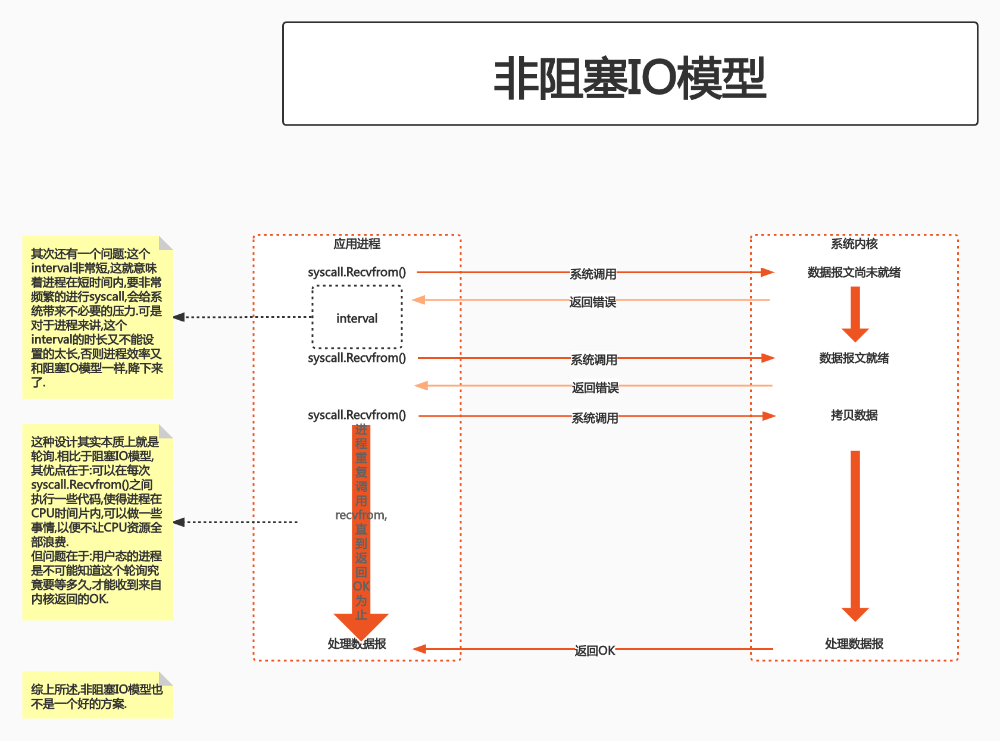
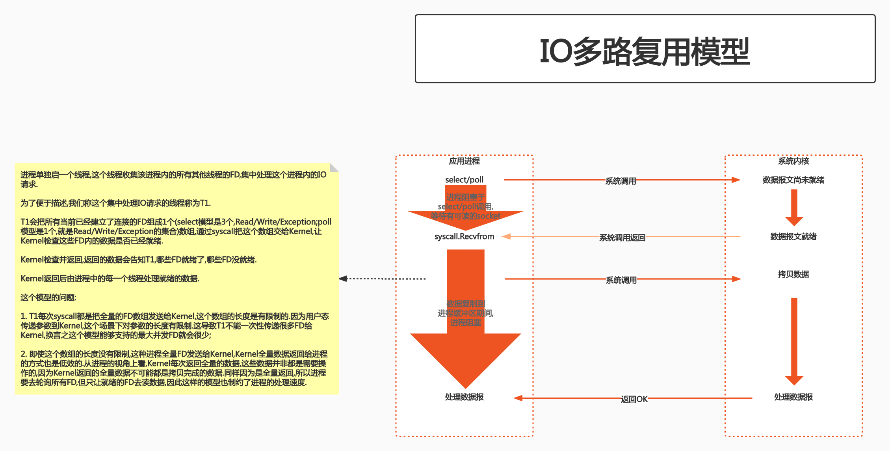
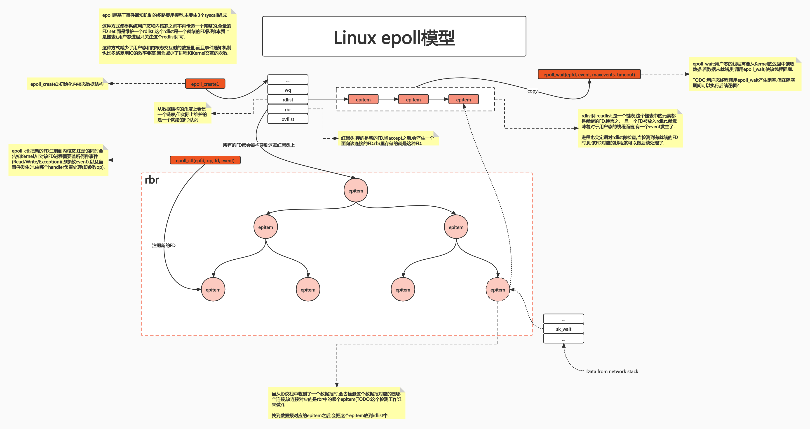
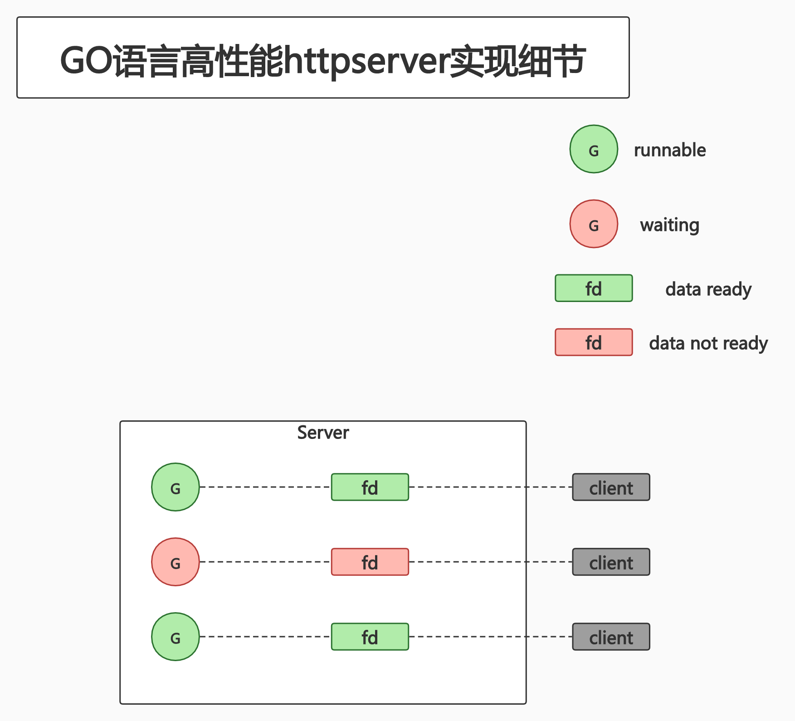

# class5 HTTP Server编写

1. 理解网络协议层
2. 理解Socket
3. 理解net.http包
4. 阻塞IO模型
5. 非阻塞IO模型
6. 异步IO
7. IO多路复用
8. Linux epoll
9. GO语言高性能http server的实现细节

## PART1. 通信基础

### 1.1 网络协议层


[TCP/IP基础知识](https://github.com/rayallen20/diagrammatizeTCP-IP/blob/master/%E7%AC%AC2%E7%AB%A0%20TCP:IP%E5%9F%BA%E7%A1%80%E7%9F%A5%E8%AF%86/%E7%AC%AC2%E7%AB%A0%20TCP-IP%E5%9F%BA%E7%A1%80%E7%9F%A5%E8%AF%86.md)

[数据链路](https://github.com/rayallen20/diagrammatizeTCP-IP/blob/master/%E7%AC%AC3%E7%AB%A0%20%E6%95%B0%E6%8D%AE%E9%93%BE%E8%B7%AF/%E7%AC%AC3%E7%AB%A0%20%E6%95%B0%E6%8D%AE%E9%93%BE%E8%B7%AF.md)

[IP协议](https://github.com/rayallen20/diagrammatizeTCP-IP/blob/master/%E7%AC%AC4%E7%AB%A0%20IP%E5%8D%8F%E8%AE%AE/%E7%AC%AC4%E7%AB%A0%20IP%E5%8D%8F%E8%AE%AE.md)

TODO:TCP层(TCP/UDP)和HTTP协议的部分还没读

### 1.2 理解socket

- socket被翻译为"套接字",它是计算机之间进行通信的一种约定或方式
- Linux中,一切皆文件
- 为了表示和区分已经打开的文件,UNIX/Linux会给每个文件分配一个ID,这个ID就是一个整数,被称为文件描述符(file descriptor)
- 网络连接也是一个文件,它也有文件描述符(此处的"网络连接",是一个TCP连接)
- 服务器端先初始化Socket,然后与端口绑定(`bind`),对端口进行监听(`listen`),调用`accpet`阻塞,等待客户端连接
- 此时如果有客户端初始化一个Socket,然后连接服务器(`connect`),如果连接成功,此时客户端与服务端的连接就建立了
- 服务端的`accept`接收到请求后,会生成连接FD,借助这个FD我们就可以使用普通的文件操作函数来传输数据了,例如:
	- 用`read()`读取从远端传过来的数据
	- 用`write()`向远端写入数据
	- 此处说的"生成连接FD",是指`accept`之后,如果连接成功,服务器端和客户端会有一个`connect`,如果`connect`成功,则会有一个新的FD,这个FD和TCP连接的FD不是一个FD


### 1.3 net.http包

```go
package main

import (
	"io"
	"net/http"
)

func main() {
	// 注册handle函数
	http.HandleFunc("/shit", shit)

	// Listen and service
	err := http.ListenAndServe("127.0.0.1:8085", nil)
	if err != nil {
		panic(err)
	}
}

// handle函数
func shit(w http.ResponseWriter, r *http.Request) {
	io.WriteString(w, "fuck")
}
```

### 1.4 IO模型

Question:如果你要设计一套客户端-服务器通信系统,有哪些通信模型可以抄?

#### 1.4.1 阻塞IO模型


#### 1.4.2 非阻塞IO模型



#### 1.4.3 异步IO模型


#### 1.4.4 IO多路复用模型



#### 1.4.5 epoll库



[请求处理方式与事件驱动模型](https://github.com/rayallen20/cloudNativeExercise/blob/master/note/module2-Write%20the%20GO%20program/class5-HTTP%20Server%E7%BC%96%E5%86%99/extend/%E8%AF%B7%E6%B1%82%E5%A4%84%E7%90%86%E6%96%B9%E5%BC%8F%E4%B8%8E%E4%BA%8B%E4%BB%B6%E9%A9%B1%E5%8A%A8%E6%A8%A1%E5%9E%8B.md)

## PART2. GO语言高性能httpserver的实现细节

### 2.1 概览

- GO语言将协程与FD资源绑定
	- 1个socket FD与1个协程绑定
	- 当socket FD未就绪时,将对应协程设置为Gwaiting状态,阻塞该协程以便把CPU时间片让给其他协程
	- GO语言runtime调度器进行调度唤醒协程时,检查Gwaiting状态的协程所对应的FD是否就绪,如果就绪则将协程置为Grunnable并加入执行队列
	- 协程被调度后处理FD数据



### 2.2 代码实现细节

TODO:模块完成后把它加到TODO List中

[httpserver代码实现](https://cncamp.notion.site/http-server-socket-detail-e1f350d63c7c4d9f86ce140949bd90c2)