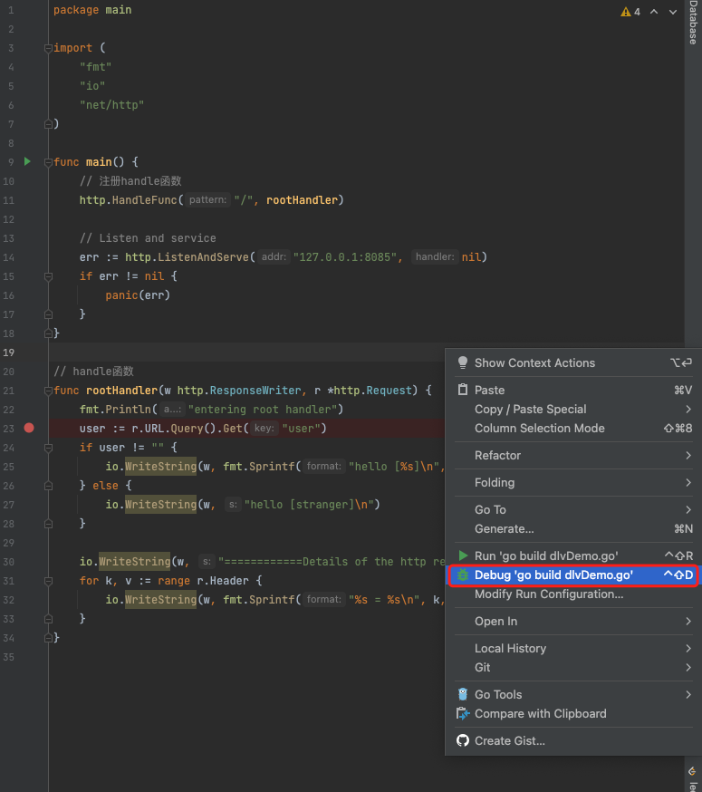
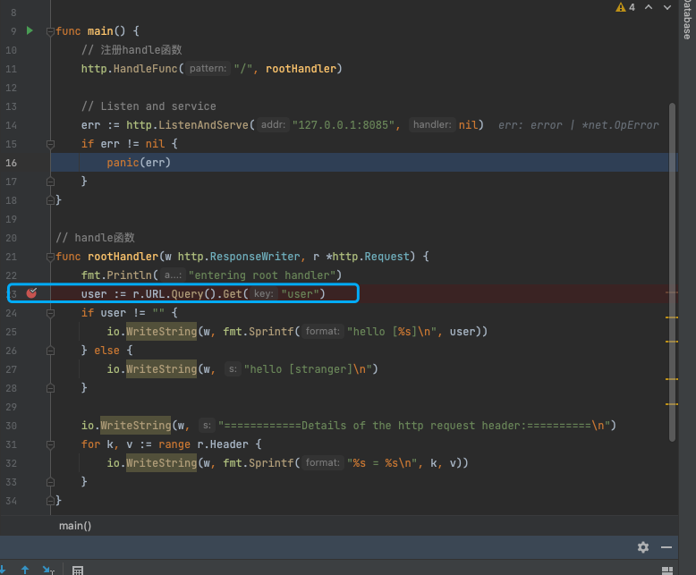
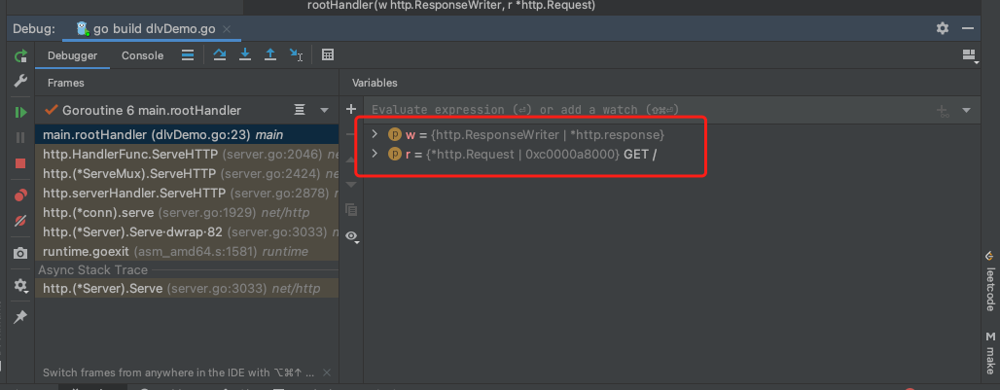
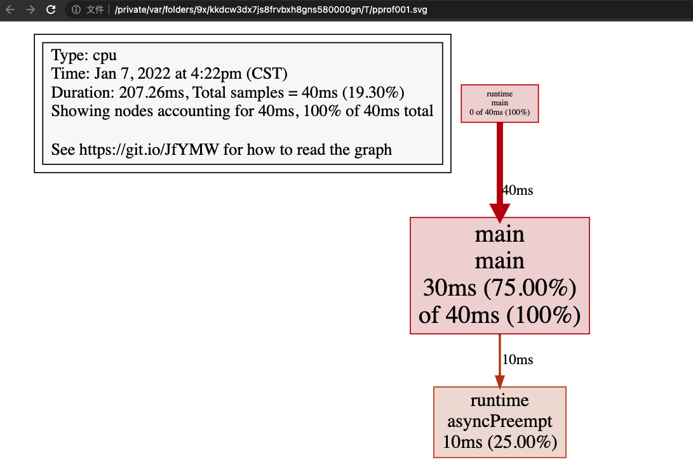

# class6 GO语言调试

1. debug工具
2. dlv
3. 日志框架
4. 性能分析
5. 针对http服务的pprof
6. pprof结果分析

## PART1. debug工具的选择与使用

### 1.1 debug工具的选择

- gdb
	- Gccgo原生支持gdb,因此可以用gdb调试GO语言代码,但dlv对GO语言debug的支持比gdb更好
	- gdb对GO语言的栈管理,多线程支持等方面做的不够好,调试代码时可能有错乱现象

- dlv
	- GO语言专有的debugger

### 1.2 dlv的安装

[安装方式](https://github.com/go-delve/delve/tree/v1.8.0/Documentation/installation)

[基本使用](https://www.cnblogs.com/li-peng/p/8522592.html)

常用操作:

1. `dlv debug`:指定要debug的文件.例:`dlv debug ./main.go`
2. `b`:打断点.
	- 例:`b main(包名).main(函数名)`,对指定的函数打断点
	- 例:`b /foo/main.go:20`,对指定的行号打断点
3. `n`:执行到下一行
4. `s`:步进
5. `p`:打印变量
6. `args`:打印所有方法的参数信息
7. `local`:打印所有本地变量

### 1.3 dlv的使用

Goland默认安装dlv.

现有代码如下:

```go
package main

import (
	"fmt"
	"io"
	"net/http"
)

func main() {
	// 注册handle函数
	http.HandleFunc("/", rootHandler)

	// Listen and service
	err := http.ListenAndServe("127.0.0.1:8085", nil)
	if err != nil {
		panic(err)
	}
}

// handle函数
func rootHandler(w http.ResponseWriter, r *http.Request) {
	fmt.Println("entering root handler")
	user := r.URL.Query().Get("user")
	if user != "" {
		io.WriteString(w, fmt.Sprintf("hello [%s]\n", user))
	} else {
		io.WriteString(w, "hello [stranger]\n")
	}

	io.WriteString(w, "============Details of the http request header:==========\n")
	for k, v := range r.Header {
		io.WriteString(w, fmt.Sprintf("%s = %s\n", k, v))
	}
}
```

- step1. 打断点
	

- step2. 以debug模式运行
	

- step3. 运行程序

	此处由于示例是一个httpserver,所以要去浏览器请求http://localhost:8085/shit.此时程序会停止在断点上
	

- step4. 查看本地变量的情况
	

## PART2. 日志的使用

如果发现bug时已经处于生产环境上时,这种情况下通常是不允许我们使用上述方式进行debug的.这种情况下更多的我们是依赖于日志去做调试的.

### 2.1 fmt包与内置函数print

这两者都是GO语言自带的工具.区别在于`fmt`是包,`print()`是内置函数.通常在读源码时,如果你需要打印一些东西,会使用`print()`.因为你在源码里import`fmt`包时,有可能导致循环依赖.

优点:不需要任何依赖

缺点:无日志重定向,无日志分级.因为这两者都是直接将日志输出到stdout的.

### 2.2 日志框架

相比于`fmt`包和内置函数`print()`,日志框架的好处在于:

- 可配置appender,便于控制输出转储
- 支持多级日志输出,可修改配置调整日志等级
- 自带时间戳和代码行,方便调试

总体上来讲,日志框架减少了我们对代码的修改.

日志框架`glog`的`init()`函数是有一些问题的.K8S以前使用`glog`,后来自己实现了一套`klog`.

[glog基本使用](https://www.cnblogs.com/sunsky303/p/11081165.html)

我自己以前也写过一套基于ELK的日志存储,非常基础,其实日志库的本质都是往`buffer`里写入格式化的内容,并定期`fulsh()`到文件中.

## PART3. 性能分析

日志能够解决的问题是逻辑上的调试和分析.还有另一种需要调试的情况:关于性能的分析与调优.这种场景使用日志是无法解决的.

GO语言有自己的性能分析(Performance Profiling,这也是为什么这个包叫pprof的原因)工具.

### 3.1 runtime/pprof的基本使用

以下代码使用`pprof`包记录了CPU的开销情况

```go
package main

import (
	"flag"
	"log"
	"os"
	"runtime/pprof"
)

var cpuProfiling *string = flag.String("cpuProfile", "./log/cpuProfile", "write cpu profile to file")

func main() {
	flag.Parse()

	f, err := os.Create(*cpuProfiling)
	if err != nil {
		panic(err)
	}

	pprof.StartCPUProfile(f)
	defer pprof.StopCPUProfile()

	var result int
	for i := 0; i < 100000000; i++ {
		result += i
	}

	log.Println("result = ", result)
}
```

运行结果如下:

```
go run cpuProfiling.go
2022/01/07 16:22:35 result =  4999999950000000
```

根据代码可知,对CPU的开销记录存储在了`./log/cpuProfile`中.但这个文件是一个二进制文件,要使用`go tool pprof`命令才能读取.

```
go tool pprof ./log/cpuProfile 
Type: cpu
Time: Jan 7, 2022 at 4:22pm (CST)
Duration: 207.26ms, Total samples = 40ms (19.30%)
Entering interactive mode (type "help" for commands, "o" for options)
(pprof) 
```

此时已经进入了分析模式

`top`命令查看各个线程占用CPU的情况

```
(pprof) top
Showing nodes accounting for 40ms, 100% of 40ms total
      flat  flat%   sum%        cum   cum%
      30ms 75.00% 75.00%       40ms   100%  main.main
      10ms 25.00%   100%       10ms 25.00%  runtime.asyncPreempt
         0     0%   100%       40ms   100%  runtime.main
```

以svg形式展示(注意:此方式依赖graphviz):

```
go tool pprof ./log/cpuProfile
Type: cpu
Time: Jan 7, 2022 at 4:22pm (CST)
Duration: 207.26ms, Total samples = 40ms (19.30%)
Entering interactive mode (type "help" for commands, "o" for options)
(pprof) web
```



### 3.2 runtime/pprof的监控目标

- CPU Porfile
	- 程序的CPU使用情况,每100毫秒采集一次CPU使用情况
- Memory Profile
	- 程序的内存使用情况
- Block Porfiling
	- 非运行态的goroutine细节,分析和查找死锁
- Goroutine Profiling
	- 所有goroutines的细节状态,包括有哪些goroutine,它们的调用关系如何

### 3.3 针对http服务的pprof

`net/http/pprof`包针对http服务提供了pprof(其实这个包只是把`runtime/pprof`封装了一下,并且在http的端口上暴露出来).

```go
package main

import (
	"fmt"
	"io"
	"net/http"
	"net/http/pprof"
)

func main() {
	foo, bar := "foo", 1
	fmt.Println(foo, bar)

	mux := http.NewServeMux()
	// Tips: 业务逻辑的handleFunc 要挂在mux上
	mux.HandleFunc("/", rootHandler)
	// 注册pprof的handler 这些handleFunc都是内置的
	mux.HandleFunc("/debug/pprof/", pprof.Index)
	mux.HandleFunc("/debug/pprof/profile", pprof.Profile)
	mux.HandleFunc("/debug/pprof/symbol", pprof.Symbol)
	mux.HandleFunc("/debug/pprof/trace", pprof.Trace)

	err := http.ListenAndServe(":80", mux)
	if err != nil {
		panic(err)
	}
}

func rootHandler(w http.ResponseWriter, r *http.Request) {
	fmt.Println("entering root handler")
	user := r.URL.Query().Get("user")
	if user != "" {
		io.WriteString(w, fmt.Sprintf("hello [%s]\n", user))
	} else {
		io.WriteString(w, "hello [stranger]\n")
	}
	io.WriteString(w, "===========Details of the http request header:=====\n")
	for k, v := range r.Header {
		io.WriteString(w, fmt.Sprintf("%s = %s\n", k, v))
	}
}
```

此时访问`http://localhost/debug/pprof/goroutine?debug=2`,即可以文本形式查看goroutine调度情况.

### 3.3 针对http服务生成火焰图

- step1. `go get github.com/uber/go-torch`
	- 下载后切换至该目录
	- `go mod init go-torch`
	- `go mod tidy`
	- `go install`
	- 把编译后的可执行文件的路径放到系统环境变量里去

- step2. `go get https://github.com/adjust/go-wrk`
	- 下载后切换至该目录
	- `go mod init go-torch`
	- `go mod tidy`
	- `go install`
	- 把编译后的可执行文件的路径放到系统环境变量里去

- step3. 开启测试
	- `go-wrk -c=400 -t=30 -n=10000 http://localhost` (此处以上文中写的http server为例)

- step4. 生成火焰图
	- `go-torch -u http://localhost -t 30 -f 123.svg` (此处只是演示,具体你的svg文件名叫啥自己填写就好;)
	- 这一步需要注意,一定要先开启测试再生成火焰图,否则会报错

- step5. 查看火焰图
	- 

火焰图的含义:

y轴表示调用栈,每一层都是一个函数.调用栈越深,火焰就越高,顶部就是调用栈最深的函数,下方就是其父函数.

x轴表示抽样数,如果一个函数在x轴方向占据的宽度越宽,就表示它被抽到的次数就越多,抽到的次数多了,自然这个函数的执行时间就长了.**注意:x轴从左到右的顺序是函数按字母顺序排列的,和执行时间无关**.

颜色无特殊含义,因为火焰图表示的是CPU的繁忙程度,故一般选择暖色调.